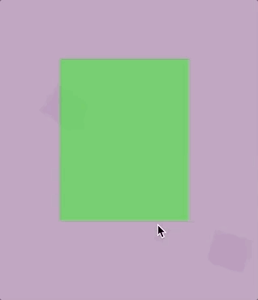
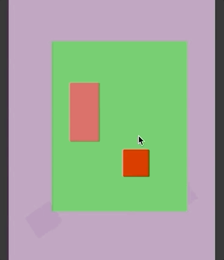
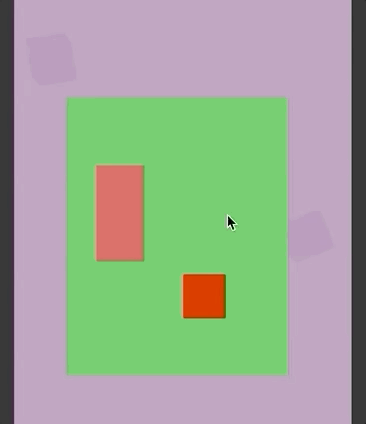

# GourdUI

GourdUI is a Unity3D utility package + framework designed to make working with complex UI easier and, most significantly, more maintainable.

**This package is currently under construction - more to come**

This repository contains the UPM package only. The Unity demo project with examples can be found here: https://github.com/mjstephens/GourdUI_Demo   

---
**Screens + Views**

An MVC-style UI framework for Unity3D. Facilitates the creation of *UIScreens* (logical units of UI) with *UIViews* (visual implementations of UIScreens):

- Separates UI logic from working displays
- Allows for multiple view options per screen (only one view will be active at a time)
- Intelligently auto-filters to select best views for each screen based on device factors
- Create *UIState* data for every screen to allow views to hot-swap, inheriting the current state so the UI position is maintained
- Enforces modularity by ensuring screens and views only communicate through *UIContracts*, which define expected functionality
- *Coming soon:* *UIScreen Wizard* editor window allows for fast creation of new screens with all requisite classes and structure created automatically
- *Coming soon:* Assign *UITriggers* to screens and/or views to quickly setup fast input-based toggling of screens
- *Coming soon:* Expanded filter options allow for inverse (not-if) view filtering

---

**Components**

GourdUI includes several modular UI components to expand or improve default functionality:

- Drag Source: Simple component allowing RectTransforms to be smoothly dragged, including momentum after drag release:

- Container Element: Use this component to enable the containment of RectTranforms within separate "container" RectTransforms. Combine with drag components to create nested "drag stacks" (left); optionally un-parent from container and add to a Container Group to enable fluid drag hierarchies (right):

 

---

Demo UI assets from:
- https://wenrexa.itch.io/ui-different03
- https://www.cleanpng.com/png-world-cricket-championship-2-icon-game-guess-the-p-608084/download-png.html
